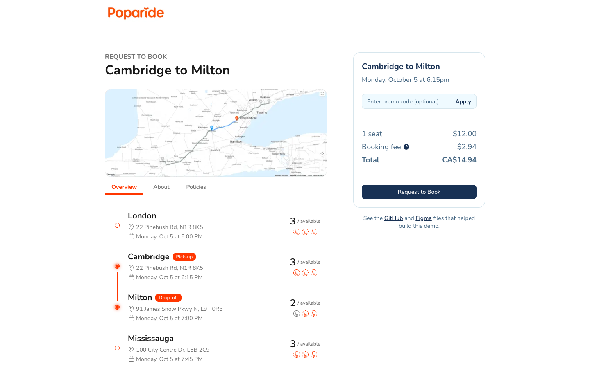
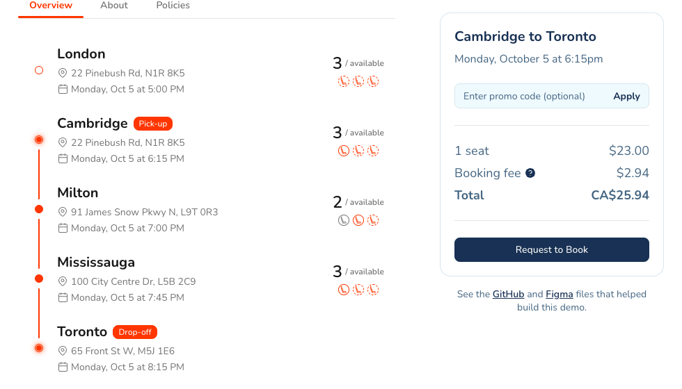
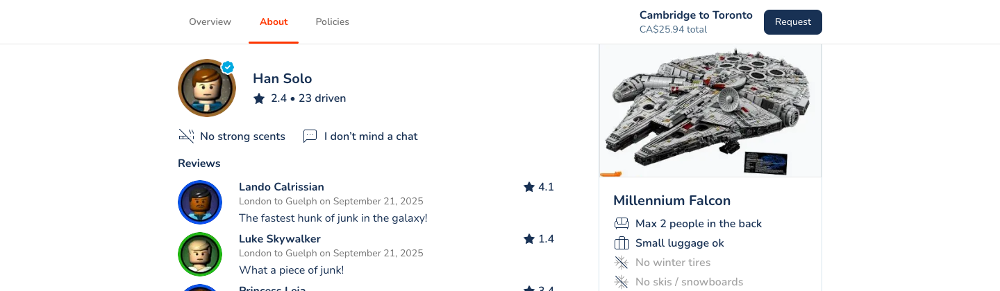
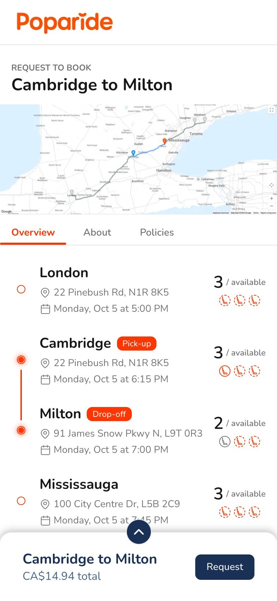
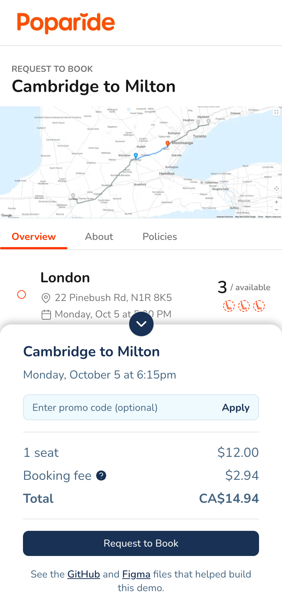

# Poparide — Request to Book

A redesign of Poparide's Request to Book page, built as a working demo in the
stack from Poparide's web job posting: Next.js, TypeScript, React Query and
Jest.

**[Live demo](https://poparide-demo.vercel.app/)** ·
[Figma file](https://www.figma.com/design/0W8ANZLVT6abxA7QABrkAK/Poparide?node-id=10-4885)

> An unofficial demo, not affiliated with Poparide. Trip, driver and review
> content is placeholder data, and nothing is booked or charged.



## The city picker

The main feature. Instead of being fixed to the stops you searched for, the
timeline lets you choose where to get on and off by tapping any stop.



- **Tap a stop and the nearest badge moves there.** A stop before the pick-up
  becomes the pick-up, a stop after the drop-off becomes the drop-off, and a
  stop in between moves whichever badge is closer.
- **Everything follows the selection:** the title, the price (the sum of the
  legs you ride), the seat limit (the fullest leg on the way), the price card
  and the navbar summary.
- **The whole row is the target**, not just the dot, so it's easy to hit with a
  mouse or a thumb. Each row is a real button, and tells screen readers what
  tapping it will do ("Set as drop-off").

## Other details

**The price card hands off to the navbar.** It stays pinned while you read;
once it scrolls away, the route, total and Request button appear in the navbar.
The section tabs dock there too and highlight the part of the page you're on.



**On phones and tablets** (below 960px) the page becomes one column, and a
bottom sheet takes the place of the price card. Collapsed it shows the route,
total and Request; tap the tab on its edge and it slides up to the full card.

| Collapsed                                                                                              | Expanded                                                                                                                           |
| ------------------------------------------------------------------------------------------------------ | ---------------------------------------------------------------------------------------------------------------------------------- |
|  |  |

**Requesting a seat** sends a Booking Request the driver has to approve, so the
button says _Request_, not _Reserve_. It shows _Sending…_, then a confirmation
or an error you can retry.

**Accessibility:** native selects and labelled fields, visible focus outlines,
larger 14px addresses and times, keyboard and screen reader support for the
stop picker and the sheet, and animations that respect reduced motion.

## Stack

| Area      | Choice                                                                                                                                                   |
| --------- | -------------------------------------------------------------------------------------------------------------------------------------------------------- |
| Framework | Next.js 16 (App Router), React 19                                                                                                                        |
| Language  | TypeScript, strict mode with `noUncheckedIndexedAccess`                                                                                                  |
| Styling   | Tailwind CSS v4, with colours, type sizes, radii and breakpoints defined as tokens taken from the Figma variables ([`globals.css`](src/app/globals.css)) |
| Data      | React Query, fetching from mock Next.js API routes                                                                                                       |
| Tests     | Jest and React Testing Library, 84 tests                                                                                                                 |
| Hosting   | Vercel                                                                                                                                                   |

## How it's put together

- **[`src/lib`](src/lib)**: the booking rules as plain functions with no React:
  pricing, seat limits, the stop picker's "nearest badge" rule, and request
  validation. The page and the API share them, and they're ready to move into
  a shared package for an Expo client.
- **[`src/app/api`](src/app/api)**: a mock API. `GET /api/trips/[id]` serves the
  trip; `POST /api/bookings` re-checks every request against the same rules and
  prices it on the server rather than trusting the client.
- **[`src/components`](src/components)**: grouped by area (`booking`, `trip`,
  `driver`, `vehicle`, `layout`, `ui`). Data loading, loading and error states
  live in `TripScreen`; the page itself works with plain props.

### Try the other states

Add `?simulate=` to the URL to see states that are hard to reach otherwise:

- [`?simulate=slow`](https://poparide-demo.vercel.app/?simulate=slow): the loading skeleton
- [`?simulate=trip-error`](https://poparide-demo.vercel.app/?simulate=trip-error): the trip fails to load
- [`?simulate=booking-error`](https://poparide-demo.vercel.app/?simulate=booking-error): sending a request fails

## Running locally

```bash
npm install
npm run dev
```

Then open [localhost:3000](http://localhost:3000).

| Script              | What it does                  |
| ------------------- | ----------------------------- |
| `npm run dev`       | Start the dev server          |
| `npm run build`     | Production build              |
| `npm test`          | Run the Jest tests            |
| `npm run lint`      | ESLint                        |
| `npm run typecheck` | TypeScript, no emit           |
| `npm run format`    | Prettier (also sorts classes) |

## Tests

- **Booking rules:** prices, seat limits and every stop picker rule, including
  one test that tries every possible selection with every possible tap.
- **API routes:** valid and invalid requests, run in the Node environment.
- **The page:** clicking through stop selection, the navbar handoff, the tabs,
  the bottom sheet, and the whole request flow against a mocked API.

## Notes

- The map and vehicle images come from the design file and are placeholders.
- Not done yet: Storybook stories for the stop timeline, price card and sheet.
